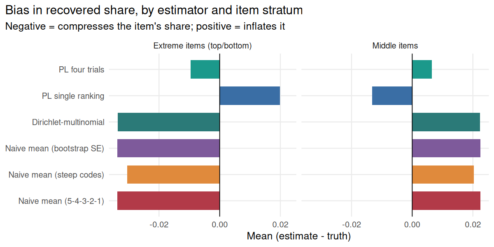
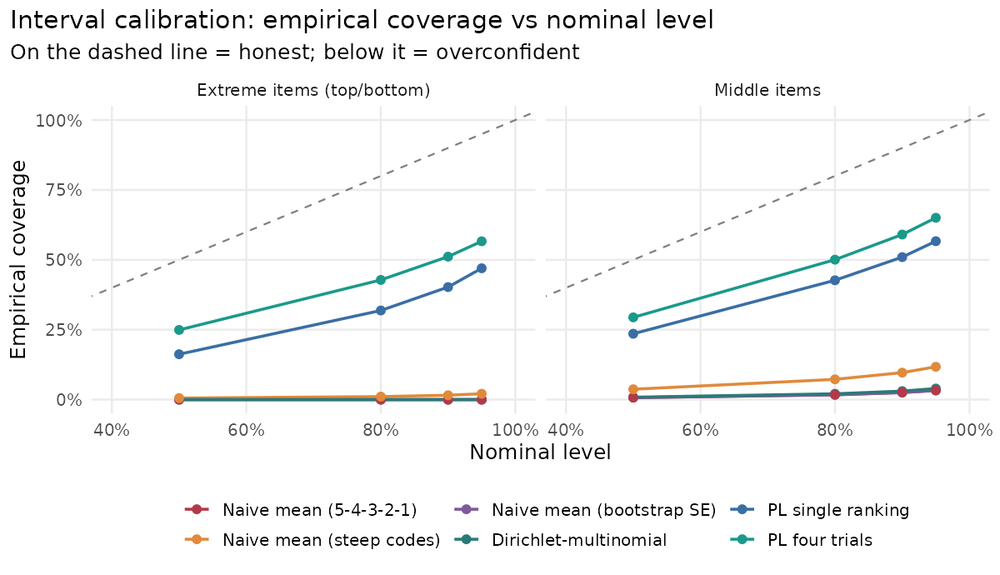
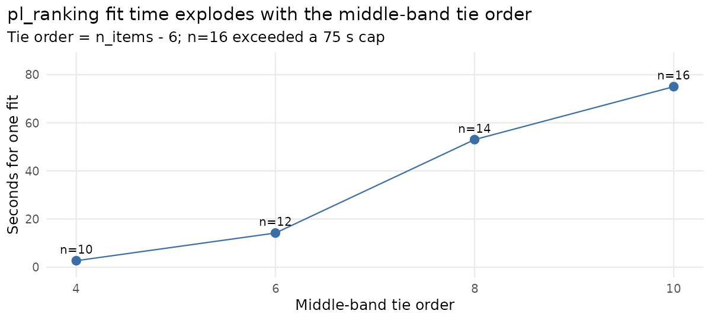

# Q-Sort Estimator Recovery — Results Draft

> **Status: draft.** Numbers and figures are from a real run of `run_study.R`
> (16 conditions × 150 replications = 2,400 simulated samples). The narrative is
> a first pass meant to be edited. Open questions are flagged at the end.

## What I ran

I planted a known importance profile (shares that sum to one, decaying as a power
law), simulated respondents through the four-pass Q-sort, fit each estimator, put
every estimate on the same share scale, and scored it against the truth — across
a grid of list length (10, 20), sample size (150, 400), lumpiness (0.6, 1.4), and
respondent noise (1, 2). Every estimator reports a point share and a standard
error, so intervals are `estimate ± z·se` and I can check coverage at any level.

The headline is simple: **the naive bucket-code mean compresses the spacing and
its intervals are not honest; the four-trial Plackett-Luce is the only candidate
that recovers the spacing and comes close to honest coverage.**

## Finding 1 — The naive mean compresses the spacing

The clearest symptom is what each estimator does to the **leader**, the single
most important item. Averaged over the grid, here is the recovered leader share
as a fraction of its true share:

| Estimator | Leader recovered ÷ truth |
|---|---:|
| Naive mean (5-4-3-2-1) | **0.30×** |
| Naive mean (bootstrap SE) | 0.30× |
| Dirichlet-multinomial | 0.30× |
| Naive mean (steep codes) | 0.38× |
| **PL four trials** | **0.80×** |
| PL single ranking | 1.33× |

The naive mean recovers the leader at less than a third of its true weight. The
forced shape caps the top band at one slot, so a runaway favorite cannot show it
is three times the runner-up; averaging the equal-spaced codes then flattens what
is left. Swapping in steeper codes (`10-5-3-1-0`) lifts the leader from 0.30× to
0.38× — moving the answer just by changing arbitrary numbers, which is direct
evidence the equal-spacing assumption is doing real work.

## Finding 2 — The single-ranking PL over-corrects

Plackett-Luce comes in two forms, and they fail in opposite directions. Bias in
the recovered share, split by item stratum:

On the **extreme** items (the top and bottom — the ones decisions hinge on):

| Estimator | Bias (extreme) | RMSE (extreme) |
|---|---:|---:|
| Naive mean | −0.034 | 0.111 |
| Dirichlet | −0.034 | 0.111 |
| Naive steep | −0.030 | 0.099 |
| PL single ranking | **+0.020** | 0.109 |
| **PL four trials** | **−0.010** | **0.051** |

The naive family pulls the extremes *toward* the middle (negative bias); the
single-ranking PL pushes the leader *past* the truth (positive bias) and ends up
with an RMSE as large as the naive mean it was meant to improve on. Only the
four-trial PL sits near zero, with less than half the error of anything else.
This matches the theory: collapsing the four passes into one top-down ranking
scores the "least" picks implicitly on the forward scale, which over-weights the
leader; modelling the two "least" passes on the reversed scale (as best-worst
does) keeps both ends honest.

## Finding 3 — Naive intervals are not honest, and the bootstrap doesn't save them

A 95% interval should contain the truth 95% of the time. Plotting empirical
coverage against the nominal level, an honest method tracks the diagonal; below
it means overconfident.

Coverage of nominal **95%** intervals:

| Estimator | Extreme | Middle |
|---|---:|---:|
| Naive mean | **0%** | 3% |
| Naive mean (bootstrap SE) | **0%** | 3% |
| Dirichlet | 0% | 4% |
| Naive mean (steep codes) | 2% | 12% |
| PL single ranking | 47% | 57% |
| **PL four trials** | **57%** | **65%** |

The naive intervals miss the extreme items essentially every time. The reason is
not that the intervals are mis-sized — the cluster bootstrap gives almost exactly
the same width as the analytic SE (0.00497 vs 0.00499 on the extremes) and the
same 0% coverage. The interval is fine; it is just **centred on the compressed
estimate**, so it sits next to the truth rather than over it. That rules out "we
did the intervals wrong" and pins the blame on the point estimate.

Note that the naive intervals are also the *narrowest* (≈0.005 wide on the
extremes, versus ≈0.033 for the four-trial PL) — they look the most precise while
being the least accurate. Falsely confident is the worst failure mode for a tool
people use to decide where to invest.

## Finding 4 — The four-trial PL is the one to use (with a caveat)

The four-trial Plackett-Luce wins on every axis: it recovers the leader at 0.80×
truth, has the lowest RMSE on the items that matter, and comes closest to honest
coverage. It is not perfect, and the caveat is worth stating plainly — its
extreme-item coverage depends heavily on respondent noise:

| Condition | PL four-trial extreme coverage (95%) |
|---|---:|
| Nominal respondents (noise = 1) | **88%** |
| Noisy respondents (noise = 2) | 25% |

At the nominal model it is nearly honest (88% against an advertised 95%); the
pooled 57% is dragged down by the noisy half of the grid. Coverage is also
slightly *worse* at the larger sample size (52% at N=400 vs 62% at N=150),
the usual pattern: bigger samples give tighter intervals, so any residual bias
bites harder. So the recommendation is the four-trial PL, with a flag that under
heavy respondent noise even it becomes overconfident and would want a wider
interval (or a noise-robust likelihood).

## Finding 5 — The single-ranking PL doesn't scale

Beyond accuracy, the single-ranking collapse has a practical wall. It has to
encode the Q-sort's middle band as one **tie of order `n_items − 6`**, and
PlackettLuce's likelihood cost grows steeply with that order:

One fit goes from ~3 seconds at 10 items to ~53 seconds at 14 and did not finish
under a 75-second cap at 16. For realistic list lengths the single-ranking model
is simply infeasible, while the four-trial factorization never forms that tie and
fits in a fraction of a second throughout. So even setting the likelihood debate
aside, the four-trial model is the only principled one that runs at scale.

## Bottom line

- **Don't trust the naive mean's spacing or its intervals.** It compresses the
  leaders, inflates the tail, and reports tight intervals that miss the extreme
  items ~100% of the time. Changing the code vector changes the answer.
- **Use the four-trial Plackett-Luce.** Lowest error on the items that matter,
  least compression, most honest intervals, fast at every list length.
- **Watch respondent noise.** Even the four-trial model becomes overconfident
  when respondents are noisy; report that limitation or widen the intervals.

## Open questions / next steps

- **Coverage is below nominal for every method on the share scale.** Even the
  four-trial PL only reaches ~57% pooled (though ~88% at noise=1). Is the
  normal-approx-on-shares interval the weak link? Worth trying a transform
  (e.g. intervals on the log-worth scale mapped through, or a parametric
  bootstrap) before concluding the model itself is overconfident.
- **Noise robustness.** The noise=2 drop is the main blemish. A scale/temperature
  term or a heavier-tailed choice model might recover coverage.
- **Heterogeneity.** Everything here assumes one population profile. If the
  audience splits into segments, add the hierarchical-Bayes layer held in reserve
  and re-check whether a single average describes anyone.
- **Wider grid.** Confirm the story holds at longer lists (30+ items) and smaller
  samples (N ≈ 75) where the naive mean is most tempting for being cheap.

---

*Reproduce: `Rscript run_study.R` then `Rscript -e 'rmarkdown::render("report.Rmd")'`.
Full per-condition figures and tables are in [`../report.md`](../report.md).*
